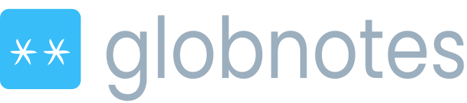

<p align="center">
  </img>
</p>

# globnotes

A self-hosted, database-less note-taking web app where **a note's title is its path** — built for Obsidian vaults and nested markdown trees.

globnotes is a fork of [flatnotes](https://github.com/dullage/flatnotes) by Adam Dullage. flatnotes deliberately keeps every note in one flat directory; globnotes keeps everything else about its spirit (zero-config, single container, distraction-free) and changes one thing: notes can live in subdirectories, and a note's title *is* its relative path.

```
data/
├── dad/
│   ├── recipes/
│   │   └── soup.md        →  note title: "dad/recipes/soup"
│   └── assets/
│       └── broth.jpg      →  served inline at /files/dad/assets/broth.jpg
└── ideas.md               →  note title: "ideas"
```

## Why

Markdown is supposed to be app-independent. If your notes already live in folders — an Obsidian vault, a git repo, a Syncthing share — globnotes gives you a clean web view (and editor) over exactly that structure, without flattening anything. Mount whatever you like as subdirectories:

```yaml
volumes:
  - /srv/dad-notes:/data/dad
  - /srv/mom-notes:/data/mom
```

Folders are never "managed": creating `a/b/c` makes the directories, renaming `a/b` → `x/y` moves the file, and empty directories are pruned away (git-style).

## Features

- **Title-as-path notes** — slashes in titles; every `.md` under `/data` is a note; full-text search and `#tags` across the whole tree (searching a path segment like `school` finds everything under it).
- **Obsidian-flavored rendering** — `[[wiki-links]]` (with `|alias` and `#heading`), `![[image embeds]]`, `==highlights==`, `> [!callouts]`, `%%comments%%`, YAML frontmatter, mermaid diagrams, KaTeX math, and relative `[links](../other.md)` that just work.
- **Vault-fidelity files** — images and files live beside the notes that use them (no separate attachments folder), so vaults stay self-contained for Syncthing/git round-trips. Anything in the tree is served: images/PDFs/media inline, markdown as raw text, everything else as a download.
- **First-run setup wizard** — no auth env vars? globnotes asks on first launch: create a password or explicitly disable auth. Open deployments are always a deliberate choice.
- **Agent-friendly** — raw markdown and files over plain HTTP (see below).

## Getting started

```bash
docker run -d \
  --name globnotes \
  -p 8080:8080 \
  -v /path/to/your/notes:/data \
  ghcr.io/alexindigo/globnotes:latest
```

Open `http://localhost:8080` and complete the first-run setup (create a password, or disable auth on a trusted network).

Or with docker compose:

```yaml
services:
  globnotes:
    image: ghcr.io/alexindigo/globnotes:latest
    container_name: globnotes
    restart: unless-stopped
    ports:
      - "8080:8080"
    volumes:
      - ./notes:/data
      # Optional: mount additional sources as subdirectories
      # - /srv/dad-notes:/data/dad
      # - /srv/mom-notes:/data/mom
    environment:
      # Optional. Leave unset for the first-run setup wizard.
      # GLOBNOTES_AUTH_TYPE: "none"  # trusted home network only!
```

## Configuration

| Variable | Default | Description |
|---|---|---|
| `GLOBNOTES_PATH` | `/data` (in container) | Root directory of the notes tree. **Required** outside docker. |
| `GLOBNOTES_AUTH_TYPE` | *(unset → first-run wizard)* | `none`, `read_only`, `password` or `totp`. Env always wins over the wizard's stored choice. |
| `GLOBNOTES_USERNAME` / `GLOBNOTES_PASSWORD` | — | Login credentials (for `password`/`totp`). If unset, taken from the wizard's stored config. |
| `GLOBNOTES_SECRET_KEY` | — | JWT signing key. If unset, taken from the wizard's stored config. |
| `GLOBNOTES_TOTP_KEY` | — | TOTP secret (for `totp`). |
| `GLOBNOTES_SESSION_EXPIRY_DAYS` | `30` | Login session length. |
| `GLOBNOTES_HOST` / `GLOBNOTES_PORT` | `0.0.0.0` / `8080` | Listen address (container). |
| `GLOBNOTES_PATH_PREFIX` | — | Serve under a sub-path, e.g. `/notes` (for reverse proxies). |
| `GLOBNOTES_QUICK_ACCESS_*` | — | `HIDE`, `TITLE`, `TERM`, `SORT`, `LIMIT` for the home page quick-access section. |

### Home network deployment

`GLOBNOTES_AUTH_TYPE=none` turns globnotes into a home-wide knowledge source: anyone (and any *agent*) on the network can read and write. `read_only` is the middle ground — open browsing, no writes ("family wiki; editing happens in Obsidian"). Either way, everything in the tree becomes reachable, so keep it to networks you trust. A warning is logged at startup when auth is off.

## Agent access

With token auth (or no auth at all), your notes are plain HTTP:

```bash
# Raw markdown, no JSON unwrapping
curl -H "Authorization: Bearer $TOKEN" https://notes.example/files/dad/recipes/soup.md

# Search
curl -H "Authorization: Bearer $TOKEN" "https://notes.example/api/search?term=soup"

# Drop a file into a vault
curl -H "Authorization: Bearer $TOKEN" \
  -F "file=@photo.jpg" -F "directory=dad/recipes" \
  https://notes.example/api/files
```

## Migrating from flatnotes

- Rename `FLATNOTES_*` env vars to `GLOBNOTES_*` (same names otherwise).
- Your `/data` works as-is: flat notes keep their titles, and the index is rebuilt automatically (`.globnotes` replaces `.flatnotes`; both are hidden and safe to delete).
- Attachments: the special `attachments/` directory is gone as a concept, but existing `attachments/x.jpg` links keep working — the directory is now just a directory, served like any other. New uploads land beside the note being edited.

## Deferred / future work

See [FutureDevelopment.md](FutureDevelopment.md) — note transclusion, unresolved-link styling, backlinks/graph, editor-side Obsidian features, and more.

## Development

```bash
# Backend tests (requires uv)
uv run pytest

# Client dev server / build
npm ci
npm run dev
npm run build
```

## Credit

globnotes is a fork of [flatnotes](https://github.com/dullage/flatnotes) by Adam Dullage, who built the excellent foundation this project stands on. GNU Lesser General Public License v3.0 licensed (see [LICENSE](LICENSE)); upstream flatnotes code remains under the MIT License (see [THIRD-PARTY-NOTICES.md](THIRD-PARTY-NOTICES.md)). Full attribution for upstream, dependencies, and the community that shaped the design lives in [THIRD-PARTY-NOTICES.md](THIRD-PARTY-NOTICES.md).
