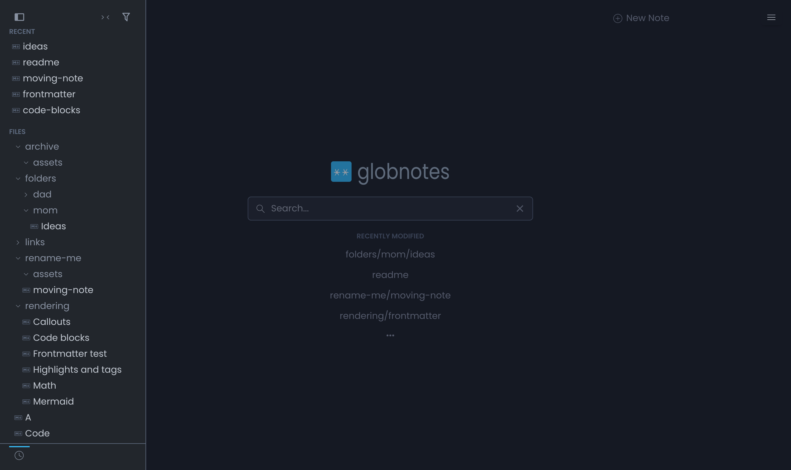

# 

A self-hosted, database-less note-taking web app where **a note's title is its path** — built for Obsidian vaults and nested markdown trees.

globnotes is a fork of [flatnotes](https://github.com/dullage/flatnotes) by Adam Dullage. flatnotes deliberately keeps every note in one flat directory; globnotes keeps everything else about its spirit (zero-config, single container, distraction-free) and changes one thing: notes can live in subdirectories, and a note's title *is* its relative path.

<p align="center">
  
</p>

```
data/
├── dad/
│   ├── recipes/
│   │   └── soup.md        →  note at /dad/recipes/soup
│   └── assets/
│       └── broth.jpg      →  served at /dad/assets/broth.jpg
└── ideas.md               →  note at /ideas
```

## Obsidian-flavored support

globnotes renders the markdown features Obsidian users rely on — and the set grows over time.

**Supported today:**

- Wikilinks `[[wikilink]]` with `|alias` and `#heading` links
- Image and file embeds `![[image.png]]`, `![[doc.pdf]]`
- Callouts `> [!note]`, `> [!warning]`, …
- Hidden comments `%%comments%%`
- Highlight `==mark==`
- Mermaid diagrams
- YAML frontmatter (title, aliases, and more)
- KaTeX math
- Automatic URL linking

**Not yet (roadmap):** note transclusion (`![[Note]]`), block references/transclusion, task lists, footnotes, abbreviations/definition lists/emoji/sub/superscript, Dataview-style queries, and graph view.

## Why

Markdown is supposed to be app-independent. If your notes already live in folders — an Obsidian vault, a git repo, a Syncthing share — globnotes gives you a clean web view (and editor) over exactly that structure, without flattening anything. Mount whatever you like as subdirectories:

```yaml
volumes:
  - /srv/dad-notes:/data/dad
  - /srv/mom-notes:/data/mom
```

Folders are never "managed": creating `a/b/c` makes the directories, renaming `a/b` → `x/y` moves the file, and empty directories are pruned away (git-style).

## Features

- **Real-path notes** — the URL path IS the vault path: `/dad/recipes/soup` is the note, `/dad/assets/broth.jpg` is its image. Relative links (``, `[x](../other.md)`) work exactly like in Obsidian — no rewriting, no magic.
- **Obsidian-flavored rendering** — `[[wiki-links]]` (with `|alias` and `#heading`), `![[image embeds]]`, `==highlights==`, `> [!callouts]`, `%%comments%%`, YAML frontmatter, mermaid diagrams, KaTeX math.
- **Sidebar folder tree** — Obsidian-style nested tree with expand/collapse, active-note highlight, filter textbox, and hover shortcuts to folder views.
- **Search modal** — one modal that jumps and searches: fuzzy-match a note by display title, alias, or path and open it, or take the pinned footer row into the full-text page. Matched characters are highlighted inline in the title/path of each row (filename hits outrank folder hits); top 10 results in a sticky footer'd list. top 9 results, every one with a `Ctrl/Cmd+N` shortcut; `Ctrl/Cmd+Enter` opens the full search with the query. Type `#` to complete tags; empty query shows this session's recently-opened notes.
- **16 themes** — light, dark, system auto-detect, Catppuccin, Dracula, Gruvbox, Nord, Solarized, Tokyo Night, and more. Pick one in the menu, preview it behind the panel, no page reload.
- **Full-text search and `#tags`** across the whole tree, scoped to a folder or recursive, with real-time filtering.
- **New-note flow** — `Untitled N` prefills in the current folder context; dead wiki-links offer a one-click "Create note" affordance.
- **Attachment-aware renames** — moving a note across folders prompts you to move its referenced files along too, or just fix the links.
- **First-run setup wizard** — no auth env vars? globnotes asks on first launch: set a password or explicitly disable auth. Each choice is deliberate.
- **Agent-friendly** — raw markdown and files over plain HTTP (see below).

## Getting started

```bash
docker run -d \
  --name globnotes \
  -p 8080:8080 \
  -v /path/to/your/notes:/data \
  alexindigo/globnotes:latest
```

Open `http://localhost:8080` and complete the first-run setup: create a password, choose read-only (browse and search, no editing), or disable auth entirely (trusted networks only).

Or with docker compose:

```yaml
services:
  globnotes:
    image: alexindigo/globnotes:latest
    container_name: globnotes
    restart: unless-stopped
    ports:
      - "8080:8080"
    volumes:
      - ./notes:/data
      # Optional: mount additional sources as subdirectories
      # - /srv/dad-notes:/data/dad
      # - /srv/mom-notes:/data/mom
    environment:
      # Optional. Leave unset for the first-run setup wizard.
      # GLOBNOTES_AUTH_TYPE: "none"  # trusted home network only!
```

The image is published to both [Docker Hub](https://hub.docker.com/r/alexindigo/globnotes) (`alexindigo/globnotes`) and [GHCR](https://github.com/alexindigo/globnotes/pkgs/container/globnotes) (`ghcr.io/alexindigo/globnotes`) — same tags (`latest`, `1.0`, `1.0.1`, …), same content; use whichever registry you prefer.

## URL model

| What | URL |
|---|---|
| Notes | `/dad/recipes/soup` — the whole root space |
| Vault files | `/dad/assets/broth.jpg` — same tree |
| App pages | `/_/login`, `/_/new`, `/_/search` |
| API, health, swagger | `/_/api/*` |
| Built assets | `/_/assets/*` |

The only reserved top-level segment is `_` — don't name a vault folder that. Everything else is yours.

`GLOBNOTES_PATH_PREFIX` is respected for multi-instance deployments (e.g. one instance at `/dad/` and another at `/mom/` behind one host) — note pages, files, API and assets all live under the prefix, and relative links keep working.

## Multiple vaults

One process can serve several independent vaults (each with its own `.globnotes`, index, plugins, brand, and auth). Set `GLOBNOTES_VAULTS`:

```yaml
volumes:
  - /srv/dad-notes:/vaults/dad
  - /srv/mom-notes:/vaults/mom
environment:
  GLOBNOTES_VAULTS: "dad:/vaults/dad,mom:/vaults/mom"
  GLOBNOTES_AUTH_TYPE_dad: "none"
  GLOBNOTES_AUTH_TYPE_mom: "none"
```

Notes live at `/dad/recipes/soup`. Disk markdown stays Obsidian-relative; globnotes prepends the slug to hrefs at render time. `/` is a vault picker (Public and Private vaults). Hidden and Secret vaults are omitted from the picker but reachable by URL.

`GLOBNOTES_PATH` alone is still today's single vault (no slug). If both PATH and VAULTS are set, PATH becomes the `globnotes` vault at `/globnotes/…`. Per-vault env uses the slug as written: `GLOBNOTES_AUTH_TYPE_dad`, `GLOBNOTES_PASSWORD_dad`, …

Mounting extra trees as subfolders of `/data` without `GLOBNOTES_VAULTS` remains one vault (shared index). Use VAULTS for isolation.

## Configuration

| Variable | Default | Description |
|---|---|---|
| `GLOBNOTES_PATH` | `/data` (in container) | Root directory of the notes tree. Required when `GLOBNOTES_VAULTS` is unset. |
| `GLOBNOTES_VAULTS` | — | Named vaults `slug:root,…` (e.g. `dad:/data/dad,mom:/data/mom`). Turns on URL namespacing. |
| `PUID` / `PGID` | `1000` / `1000` | User the app runs as (container). Set to your host user's ids (`id -u` / `id -g`) so note edits can write. **globnotes never `chown`s your vault** — it only creates/owns the `.globnotes` index dir. |
| `GLOBNOTES_INDEX_BATCH_SIZE` | `200` | Notes indexed per commit batch during the initial background sync. Lower it on very constrained hosts. |
| `GLOBNOTES_INDEX_BATCH_DELAY` | `0.1` | Seconds to sleep between index batches (CPU throttle). `0` disables. |
| `GLOBNOTES_SCAN_CACHE_TTL` | `15` | Seconds the vault file listing is cached (large vaults: raise it). |
| `GLOBNOTES_AUTO_ENABLE_PLUGINS` | `true` | Default for new plugins in the settings UI (per-browser switches override). |
| `GLOBNOTES_RENDER_WORKERS` | `2` | Sandboxed Deno Workers per plugin for rendering (heartbeats + auto-respawn). |
| `GLOBNOTES_AUTH_TYPE` | *(unset → first-run wizard)* | `none`, `read_only`, `password` or `totp`. Env always wins over the wizard's stored choice. |
| `GLOBNOTES_USERNAME` / `GLOBNOTES_PASSWORD` | — | Login credentials (for `password`/`totp`). If unset, taken from the wizard's stored config. |
| `GLOBNOTES_SECRET_KEY` | — | JWT signing key. If unset, taken from the wizard's stored config. |
| `GLOBNOTES_TOTP_KEY` | — | TOTP secret (for `totp`). |
| `GLOBNOTES_SESSION_EXPIRY_DAYS` | `30` | Login session length. |
| `GLOBNOTES_HOST` / `GLOBNOTES_PORT` | `0.0.0.0` / `8080` | Listen address (container). |
| `GLOBNOTES_PATH_PREFIX` | — | Serve under a sub-path, e.g. `/mom` (multi-instance reverse proxies). |
| `GLOBNOTES_QUICK_ACCESS_*` | — | `HIDE`, `TITLE`, `TERM`, `SORT`, `LIMIT` for the home page quick-access section. |
| `GLOBNOTES_BRAND_NAME` / `GLOBNOTES_BRAND_ACCENT` | — | White-label branding (see [Branding](#branding)). Env wins over the Branding dialog's stored values. |

### Home network deployment

`GLOBNOTES_AUTH_TYPE=none` turns globnotes into a home-wide knowledge source: anyone (and any *agent*) on the network can read and write. `read_only` is the middle ground — open browsing, no writes ("family wiki; editing happens in Obsidian"). Either way, everything in the tree becomes reachable, so keep it to networks you trust. A warning is logged at startup when auth is off.

## Agent access

With token auth (or no auth at all), your notes are plain HTTP:

```bash
# Raw markdown
curl -H "Authorization: Bearer $TOKEN" https://notes.example/_/api/files/dad/recipes/soup.md

# Search (add folder=dad/recipes to scope to a subtree, nested=false for root-only)
curl -H "Authorization: Bearer $TOKEN" "https://notes.example/_/api/search?term=soup"

# Drop a file into a vault
curl -H "Authorization: Bearer $TOKEN" \
  -F "file=@photo.jpg" -F "directory=dad/recipes" \
  https://notes.example/_/api/files
```

## Migrating from flatnotes

- Rename `FLATNOTES_*` env vars to `GLOBNOTES_*` (same names otherwise).
- Your `/data` works as-is: flat notes keep their titles, and the index is rebuilt automatically (`.globnotes` replaces `.flatnotes`; both are hidden and safe to delete).
- The special `attachments/` directory is gone as a concept — existing `attachments/x.jpg` links keep working (it's now just a directory, served like any other). New uploads land beside the note being edited.

## Plugins

Rendering is a markdown-it pipeline extended by **plugins** — each running in its own permission-narrowed Deno Worker (no network/env/write unless the manifest asks). The built-ins (`globnotes-autolinks`, `-callout`, `-comments`, `-embeds`, `-mark`, `-mermaid`) produce the Obsidian-flavored rendering out of the box; drop your own into `<vault>/.globnotes/plugins/<id>/` and they join the pipeline. Per-plugin switches and the auto-enable default live in the menu → **Plugins** dialog. See [docs/plugins.md](docs/plugins.md) for the authoring guide.

## Event bus

Components communicate over a mitt-based client-side event bus — publishers announce facts like "note renamed" or "theme changed," consumers decide what to refresh. 59 topics cover note lifecycle, sidebar, menus and modals, edit sessions, themes, plugins, files, search, and the editor action channel (`editor:*` / `app:*`). See [docs/event-bus.md](docs/event-bus.md) for the topic registry and usage guide.

## Keybindings

Keyboard shortcuts are a **switchable layer** — **navbar menu → Keybindings** opens a panel whose left rail picks one of five named layers (**Legacy Flatnotes**, **Obsidian**, **Notion**, **Typora**, **VS Code-lite**) plus a **Custom** layer, with a cheat sheet of the active layer's bindings beside it.

- **Cross-layer constants:** `Ctrl+Alt+N` (new note) and `Ctrl+Alt+H` (home) work everywhere — every app's own new-note key is browser-reserved.
- **Save:** Legacy keeps `Ctrl/Cmd+Enter`; the other layers use `Mod+S` with `Ctrl/Cmd+Enter` kept as an alias. Legacy also restores Flatnotes' `/` for the quick switcher.
- **Honest no-ops:** layers only remap actions globnotes has — Notion's `/` (slash menu) or Obsidian's `Mod+P` (command palette) are bound but do nothing.
- **Both editors, one channel:** keys reach the editors as `editor:*` actions on the event bus, so source mode and WYSIWYG handle the same layer — formatting actions that WYSIWYG applies natively are applied in source mode as markdown-syntax edits (Typora-style). The layer also fixes latent keymap conflicts: `Mod+Enter` saves instead of inserting a blank line, `Mod+I` toggles italic, and Escape collapses a multi-cursor selection before exiting.
- **Custom layer:** starts as a copy of Legacy; in the cheat sheet, click any binding and press a new key to remap it (marked entries reset with ↺). Overrides are stored per-browser in `localStorage`, same as the theme choice.

## Branding

Make an instance yours without touching code: **navbar menu → Branding** sets the brand **name**, an **accent color**, and uploads a **logo / icon** (SVG, PNG, JPG, WebP, GIF or ICO). Everything lives inside the vault — name and accent in `.globnotes/config.json`, files in `.globnotes/brand/` — so branding travels with the vault like everything else.

- The accent recolors the Globnotes Light/Dark themes; themes with a brand color of their own keep it.
- The brand name replaces "globnotes" in the browser tab, the web manifest, and the navbar wordmark.
- A custom `icon.svg` doubles as the browser-tab favicon; drop dedicated favicon files to go further.

Favicon files are file-drop only — no dialog fields. Drop them into `<vault>/.globnotes/brand/`:

| File | Replaces |
|---|---|
| `favicon.ico` | the shortcut icon |
| `favicon-16x16.png` / `favicon-32x32.png` | tab favicons |
| `apple-touch-icon.png` | iOS home-screen icon |
| `safari-pinned-tab.svg` | Safari pinned tab |
| `site.webmanifest` | the PWA manifest (generated from the brand config when absent) |

`GLOBNOTES_BRAND_NAME` / `GLOBNOTES_BRAND_ACCENT` (`#rrggbb`) are the env equivalents; env always wins over the dialog.

## Deferred / future work

See [FutureDevelopment.md](FutureDevelopment.md) — note transclusion, unresolved-link styling, backlinks/graph, compat hats, and more.

## Development

```bash
# Install everything (all dependencies resolve from deno.json)
deno install

# Server — tests, lint, type check
deno task test       # 121 integration + unit tests
deno task lint
deno task check

# Client build & unit tests (via Deno npm compat — no npm/node required)
deno task build:client
deno task test:client

# Client dev server (Vite under Deno)
deno task dev:client
```

## Credit

globnotes is a fork of [flatnotes](https://github.com/dullage/flatnotes) by Adam Dullage, who built the excellent foundation this project stands on. GNU Lesser General Public License v3.0 licensed (see [LICENSE](LICENSE)); upstream flatnotes code remains under the MIT License (see [THIRD-PARTY-NOTICES.md](THIRD-PARTY-NOTICES.md)). Full attribution for upstream, dependencies, and the community that shaped the design lives in [THIRD-PARTY-NOTICES.md](THIRD-PARTY-NOTICES.md).
