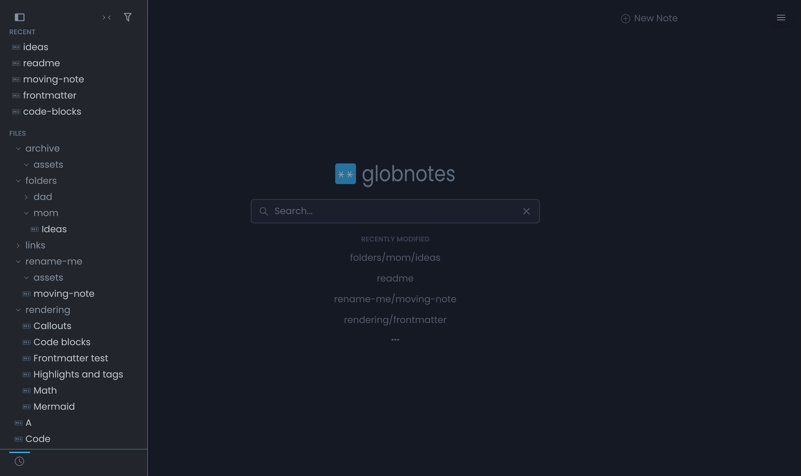

# 

A self-hosted, database-less note-taking web app built for Obsidian vaults and nested Markdown trees.

globnotes is a fork of [flatnotes](https://github.com/dullage/flatnotes) by Adam Dullage. flatnotes deliberately keeps every note in one flat directory; globnotes keeps its spirit (zero-config, single container, distraction-free) and adds support for notes in subdirectories. A note's relative path identifies it; its display title can come from its content.

<p align="center">
  
</p>

```
data/
├── dad/
│   ├── recipes/
│   │   └── soup.md        →  note at /dad/recipes/soup
│   └── assets/
│       └── broth.jpg      →  served at /dad/assets/broth.jpg
└── ideas.md               →  note at /ideas
```

## Obsidian-flavored support

globnotes renders the markdown features Obsidian users rely on — and the set grows over time.

**Supported today:**

- Wikilinks `[[wikilink]]` with `|alias` and `#heading` links
- Image and file embeds `![[image.png]]`, `![[doc.pdf]]`
- Callouts `> [!note]`, `> [!warning]`, …
- Hidden comments `%%comments%%`
- Highlight `==mark==`
- Mermaid diagrams
- YAML frontmatter (title, aliases, and more)
- KaTeX math
- Automatic URL linking

**Not yet (roadmap):** note transclusion (`![[Note]]`), block references/transclusion, task lists, footnotes, abbreviations/definition lists/emoji/sub/superscript, Dataview-style queries, and graph view.

## Why

Markdown is supposed to be app-independent. If your notes already live in folders — an Obsidian vault, a git repo, a Syncthing share — globnotes gives you a clean web view (and editor) over exactly that structure, without flattening anything. Mount whatever you like as subdirectories:

```yaml
volumes:
  - /srv/dad-notes:/data/dad
  - /srv/mom-notes:/data/mom
```

Folders are never "managed": creating `a/b/c` makes the directories, renaming `a/b` → `x/y` moves the file, and empty directories are pruned away (git-style).

## Features

- **Real-path notes** — the URL path IS the vault path: `/dad/recipes/soup` is the note, `/dad/assets/broth.jpg` is its image. Relative links (``, `[x](../other.md)`) work exactly like in Obsidian — no rewriting, no magic.
- **Obsidian-flavored rendering** — `[[wiki-links]]` (with `|alias` and `#heading`), `![[image embeds]]`, `==highlights==`, `> [!callouts]`, `%%comments%%`, YAML frontmatter, mermaid diagrams, KaTeX math.
- **Sidebar folder tree** — Obsidian-style nested tree with expand/collapse, active-note highlight, filter textbox, and hover shortcuts to folder views.
- **Search modal** — one modal that jumps and searches: fuzzy-match a note by display title, alias, or path and open it, or take the pinned footer row into the full-text page. Matched characters are highlighted inline in the title/path of each row (filename hits outrank folder hits); top 10 results in a sticky footer'd list. top 9 results, every one with a `Ctrl/Cmd+N` shortcut; `Ctrl/Cmd+Enter` opens the full search with the query. Type `#` to complete tags; empty query shows this session's recently-opened notes.
- **16 themes** — light, dark, system auto-detect, Catppuccin, Dracula, Gruvbox, Nord, Solarized, Tokyo Night, and more. Pick one in **Settings → Appearance**, preview it behind the panel, no page reload.
- **Full-text search and `#tags`** across the whole tree, scoped to a folder or recursive, with real-time filtering.
- **New-note flow** — `Untitled N` prefills in the current folder context; dead wiki-links offer a one-click "Create note" affordance.
- **Attachment-aware renames** — moving a note across folders prompts you to move its referenced files along too, or just fix the links.
- **First-run setup wizard** — no auth env vars? globnotes asks on first launch: set a password or explicitly disable auth. Each choice is deliberate.
- **Agent-friendly** — raw markdown and files over plain HTTP (see below).

## Getting started

```bash
docker run -d \
  --name globnotes \
  -p 8080:8080 \
  -v /path/to/your/notes:/data \
  alexindigo/globnotes:latest
```

Open `http://localhost:8080` and complete the first-run setup: create a password, choose read-only (browse and search, no editing), or disable auth entirely (trusted networks only).

Or with docker compose:

```yaml
services:
  globnotes:
    image: alexindigo/globnotes:latest
    container_name: globnotes
    restart: unless-stopped
    ports:
      - "8080:8080"
    volumes:
      - ./notes:/data
      # Optional: mount additional sources as subdirectories
      # - /srv/dad-notes:/data/dad
      # - /srv/mom-notes:/data/mom
    environment:
      # Optional. Leave unset for the first-run setup wizard.
      # GLOBNOTES_AUTH_TYPE: "none"  # trusted home network only!
```

The image is published to both [Docker Hub](https://hub.docker.com/r/alexindigo/globnotes) (`alexindigo/globnotes`) and [GHCR](https://github.com/alexindigo/globnotes/pkgs/container/globnotes) (`ghcr.io/alexindigo/globnotes`) — same tags (`latest`, `1.0`, `1.0.1`, …), same content; use whichever registry you prefer.

## URL model

| What | URL |
|---|---|
| Notes | `/dad/recipes/soup` — the whole root space |
| Vault files | `/dad/assets/broth.jpg` — same tree |
| App pages | `/_/login`, `/_/new`, `/_/search` |
| API, health, swagger | `/_/api/*` |
| Built assets | `/_/assets/*` |

The only reserved top-level segment is `_` — don't name a vault folder that. Everything else is yours.

`GLOBNOTES_PATH_PREFIX` is respected for multi-instance deployments (e.g. one instance at `/dad/` and another at `/mom/` behind one host) — note pages, files, API and assets all live under the prefix, and relative links keep working.

## Configuration

| Variable | Default | Description |
|---|---|---|
| `GLOBNOTES_PATH` | `/data` (in container) | Root directory of the notes tree. **Required** outside docker. |
| `GLOBNOTES_INDEX_PATH` | `<vault>/.globnotes` | State dir (search index, wizard config, branding, plugins). The value IS the directory (not a parent). Set it to keep the vault pure notes — e.g. for backup jobs that should only see markdown. On first boot with it set and a legacy vault, the exact `mv` command is logged; state is never auto-copied. |
| `PUID` / `PGID` | vault owner | User the app runs as (container). Defaults to the notes vault's owner (so an Unraid `nobody:users` share needs zero configuration); set explicit ids to override. **globnotes never `chown`s your vault** — it only re-owns the state dir at boot (by design; failure-tolerant on root-squashed mounts). |
| `GLOBNOTES_INDEX_BATCH_SIZE` | `200` | Notes indexed per commit batch during the initial background sync. Lower it on very constrained hosts. |
| `GLOBNOTES_INDEX_BATCH_DELAY` | `0.1` | Seconds to sleep between index batches (CPU throttle). `0` disables. |
| `GLOBNOTES_SCAN_CACHE_TTL` | `15` | Seconds the vault file listing is cached (large vaults: raise it). |
| `GLOBNOTES_AUTO_ENABLE_PLUGINS` | `true` | Auto-enable default for new plugins. An explicit environment value pins that default; vault per-plugin enable/disable choices retain precedence. |
| `GLOBNOTES_RENDER_WORKERS` | `2` | Sandboxed Deno Workers per plugin for rendering (heartbeats + auto-respawn). |
| `GLOBNOTES_AUTH_TYPE` | *(unset → first-run wizard)* | `none`, `read_only`, `password` or `totp`. Env always wins over the wizard's stored choice. The wizard can also enrol `totp` itself (password mode → authenticator toggle): it mints a key, shows the QR, and requires a valid code before finishing. |
| `GLOBNOTES_READ_ONLY_SETTINGS` | Stored choice, otherwise `false` | In public (`none`) mode, lock server-owned settings independently of note editing. An explicit `true` or `false` overrides the saved choice. |
| `GLOBNOTES_USERNAME` / `GLOBNOTES_PASSWORD` | — | Login credentials (for `password`/`totp`). If unset, taken from the wizard's stored config. |
| `GLOBNOTES_SECRET_KEY` | — | JWT signing key. If unset, taken from the wizard's stored config. |
| `GLOBNOTES_TOTP_KEY` | — | TOTP secret (for `totp`). If unset, taken from the wizard's stored config; the boot-log QR is printed only for env-provided keys. |
| `GLOBNOTES_SESSION_EXPIRY_DAYS` | `30` | Login session length. |
| `GLOBNOTES_HOST` / `GLOBNOTES_PORT` | `0.0.0.0` / `8080` | Listen address (container). |
| `GLOBNOTES_PATH_PREFIX` | — | Serve under a sub-path, e.g. `/mom` (multi-instance reverse proxies). |
| `GLOBNOTES_QUICK_ACCESS_*` | — | `HIDE`, `TITLE`, `TERM`, `SORT`, `LIMIT` for the home page quick-access section. |
| `GLOBNOTES_BRAND_NAME` / `GLOBNOTES_BRAND_ACCENT` | — | White-label branding (see [Branding](#branding)). Env wins over the Branding dialog's stored values. |

### Home network deployment

`GLOBNOTES_AUTH_TYPE=none` turns globnotes into a home-wide knowledge source: anyone (and any *agent*) on the network can read and write. `read_only` is the middle ground — open browsing, no writes ("family wiki; editing happens in Obsidian"). Either way, everything in the tree becomes reachable, so keep it to networks you trust. A warning is logged at startup when auth is off.

### Access settings

**Settings → Access** updates the existing account in place. Leave the new-password
field blank to keep the current password hash. Adding an authenticator first
shows its enrolment QR; credentials and sessions remain unchanged until its new
code is confirmed. Protected access changes additionally require the current
password and current authenticator code when already enabled. A committed
password/2FA change invalidates old sessions and requires sign-in with the
confirmed credentials. Cancelling enrolment does not reset setup or the account.

The public-access panel's **Read-only settings** locks access/security, branding,
vault plugin policy/settings and operator permissions while retaining public note
editing and browser-local theme/keybinding/line-number/debug preferences. It
defaults off for initial public setup, on for a saved other-mode → public change,
and remains selectable before saving. Existing public deployments without the
option retain writable settings. Read-only note access still denies note writes.

Locked public settings cannot unlock themselves through the UI, API or legacy
setup/reset URL. Recover through deployment configuration: set
`GLOBNOTES_READ_ONLY_SETTINGS=false` and restart the deployment, or edit
`read_only_settings` in the state directory's `config.json` and restart. Environment
values retain precedence. Public/read-only modes provide no management-only
login. Environment-pinned credentials/signing keys must be changed through their
deployment configuration when they prevent a requested effective transition.

## Agent access

With token auth (or no auth at all), your notes are plain HTTP:

```bash
# Raw markdown
curl -H "Authorization: Bearer $TOKEN" https://notes.example/_/api/files/dad/recipes/soup.md

# Search (add folder=dad/recipes to scope to a subtree, nested=false for root-only)
curl -H "Authorization: Bearer $TOKEN" "https://notes.example/_/api/search?term=soup"

# Drop a file into a vault
curl -H "Authorization: Bearer $TOKEN" \
  -F "file=@photo.jpg" -F "directory=dad/recipes" \
  https://notes.example/_/api/files
```

## Migrating from flatnotes

- Rename `FLATNOTES_*` env vars to `GLOBNOTES_*` (same names otherwise).
- Your `/data` works as-is: flat notes keep their titles, and the index is rebuilt automatically (`.globnotes` replaces `.flatnotes`; both are hidden and safe to delete).
- The special `attachments/` directory is gone as a concept — existing `attachments/x.jpg` links keep working (it's now just a directory, served like any other). New uploads land beside the note being edited.

## Plugins

Plugins can contribute rendering, server workflows and guards, browser/editor
extensions, commands, settings pages and sandboxed HTTP endpoints. The built-ins
(`globnotes-autolinks`, `-callout`, `-comments`, `-embeds`, `-mark`, `-mermaid`)
provide the Obsidian-flavored rendering; install your own under
`<state dir>/plugins/<id>/` (`<vault>/.globnotes` by default).

Open **Settings → Plugins** for inventory, enablement, auto-enable and permission
review. Vault policy owns server, browser and editor activation across browsers.
Legacy browser render preferences may suppress an already vault-enabled renderer
for a request; they cannot activate a vault-disabled plugin or stop server
workflows. Theme/keybindings remain browser preferences.

Server contributions run in permission-narrowed Deno Workers. Manifests request
network data and remote-code import access; effective rights also require the
per-plugin **Allow network** master, operator approval and parent authority.
Browser/editor code remains trusted same-origin code, and these server controls
do not restrict browser network loads from rendered content. Explicit legacy raw
filesystem grants remain a separate trust boundary. See the
[authoring guide](docs/plugins.md) and [Plugin API](docs/plugin-api.md).

## Event bus

Components communicate over a mitt-based client-side event bus — publishers announce facts like "note renamed" or "theme changed," consumers decide what to refresh. 59 topics cover note lifecycle, sidebar, menus and modals, edit sessions, themes, plugins, files, search, and the editor action channel (`editor:*` / `app:*`). See [docs/event-bus.md](docs/event-bus.md) for the topic registry and usage guide.

## Keybindings

Keyboard shortcuts are a **switchable layer** — **Settings → Keybindings** shows a rail with five named layers (**Legacy Flatnotes**, **Obsidian**, **Notion**, **Typora**, **VS Code-lite**) plus a **Custom** layer, with a cheat sheet of the active layer's bindings beside it.

- **Cross-layer constants:** `Ctrl+Alt+N` (new note) and `Ctrl+Alt+H` (home) work everywhere — every app's own new-note key is browser-reserved.
- **Save:** Legacy keeps `Ctrl/Cmd+Enter`; the other layers use `Mod+S` with `Ctrl/Cmd+Enter` kept as an alias. Legacy also restores Flatnotes' `/` for the quick switcher.
- **Host commands:** Obsidian's `Mod+P` and VS Code-lite's `Mod+Shift+P` open the command palette, including registered plugin commands. Notion's slash-menu action remains unimplemented.
- **Both editors, one channel:** keys reach the editors as `editor:*` actions on the event bus, so source mode and WYSIWYG handle the same layer — formatting actions that WYSIWYG applies natively are applied in source mode as markdown-syntax edits (Typora-style). The layer also fixes latent keymap conflicts: `Mod+Enter` saves instead of inserting a blank line, `Mod+I` toggles italic, and Escape collapses a multi-cursor selection before exiting.
- **Custom layer:** starts as a copy of Legacy; in the cheat sheet, click any binding and press a new key to remap it (marked entries reset with ↺). Overrides are stored per-browser in `localStorage`, same as the theme choice.

## Branding

Make an instance yours without touching code: **Settings → Branding** sets the brand **name**, an **accent color**, and uploads a **logo / icon** (SVG, PNG, JPG, WebP, GIF or ICO). Everything lives in the state dir — name and accent in `config.json`, files in `brand/` — so branding travels with the vault like everything else (unless the state dir is relocated with `GLOBNOTES_INDEX_PATH`, in which case it travels with that).

- The accent recolors the Globnotes Light/Dark themes; themes with a brand color of their own keep it.
- The brand name replaces "globnotes" in the browser tab, the web manifest, and the navbar wordmark.
- A custom `icon.svg` doubles as the browser-tab favicon; drop dedicated favicon files to go further.

Favicon files are file-drop only — no dialog fields. Drop them into `<vault>/.globnotes/brand/`:

| File | Replaces |
|---|---|
| `favicon.ico` | the shortcut icon |
| `favicon-16x16.png` / `favicon-32x32.png` | tab favicons |
| `apple-touch-icon.png` | iOS home-screen icon |
| `safari-pinned-tab.svg` | Safari pinned tab |
| `site.webmanifest` | the PWA manifest (generated from the brand config when absent) |

`GLOBNOTES_BRAND_NAME` / `GLOBNOTES_BRAND_ACCENT` (`#rrggbb`) are the env equivalents; env always wins over the dialog.

## Deferred / future work

See [FutureDevelopment.md](FutureDevelopment.md) — note transclusion, unresolved-link styling, backlinks/graph, compat hats, and more.

## Development

```bash
# Install everything (all dependencies resolve from deno.json)
deno install

# Server — tests, lint, type check
deno task test       # Server integration and unit tests
deno task lint
deno task check

# Client build & unit tests (via Deno npm compat — no npm/node required)
deno task build:client
deno task test:client
```

## Credit

globnotes is a fork of [flatnotes](https://github.com/dullage/flatnotes) by Adam Dullage, who built the excellent foundation this project stands on. GNU Lesser General Public License v3.0 licensed (see [LICENSE](LICENSE)); upstream flatnotes code remains under the MIT License (see [THIRD-PARTY-NOTICES.md](THIRD-PARTY-NOTICES.md)). Full attribution for upstream, dependencies, and the community that shaped the design lives in [THIRD-PARTY-NOTICES.md](THIRD-PARTY-NOTICES.md).
